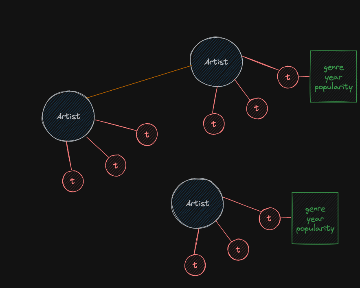
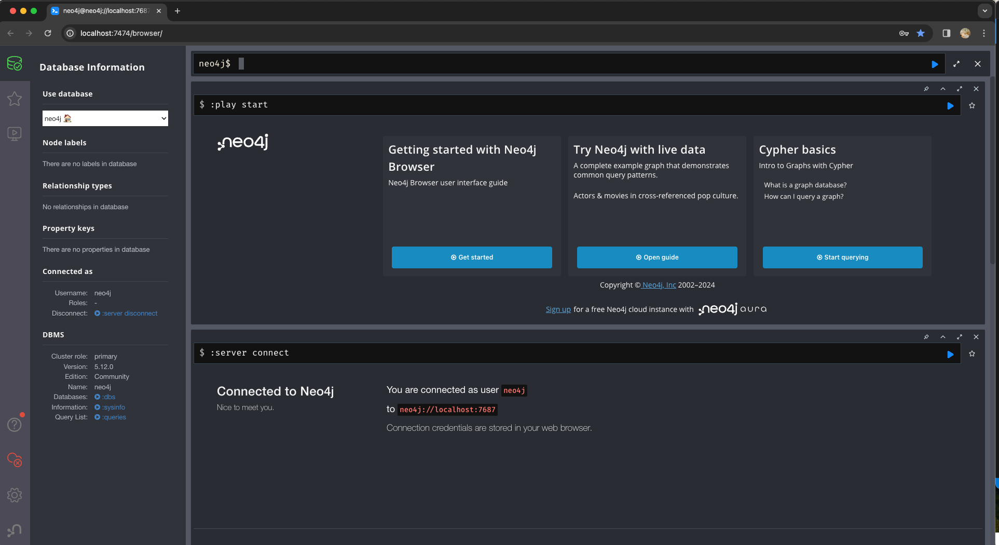
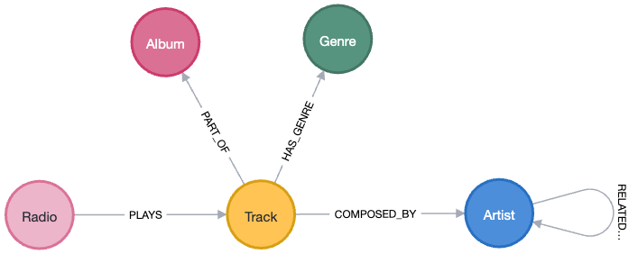
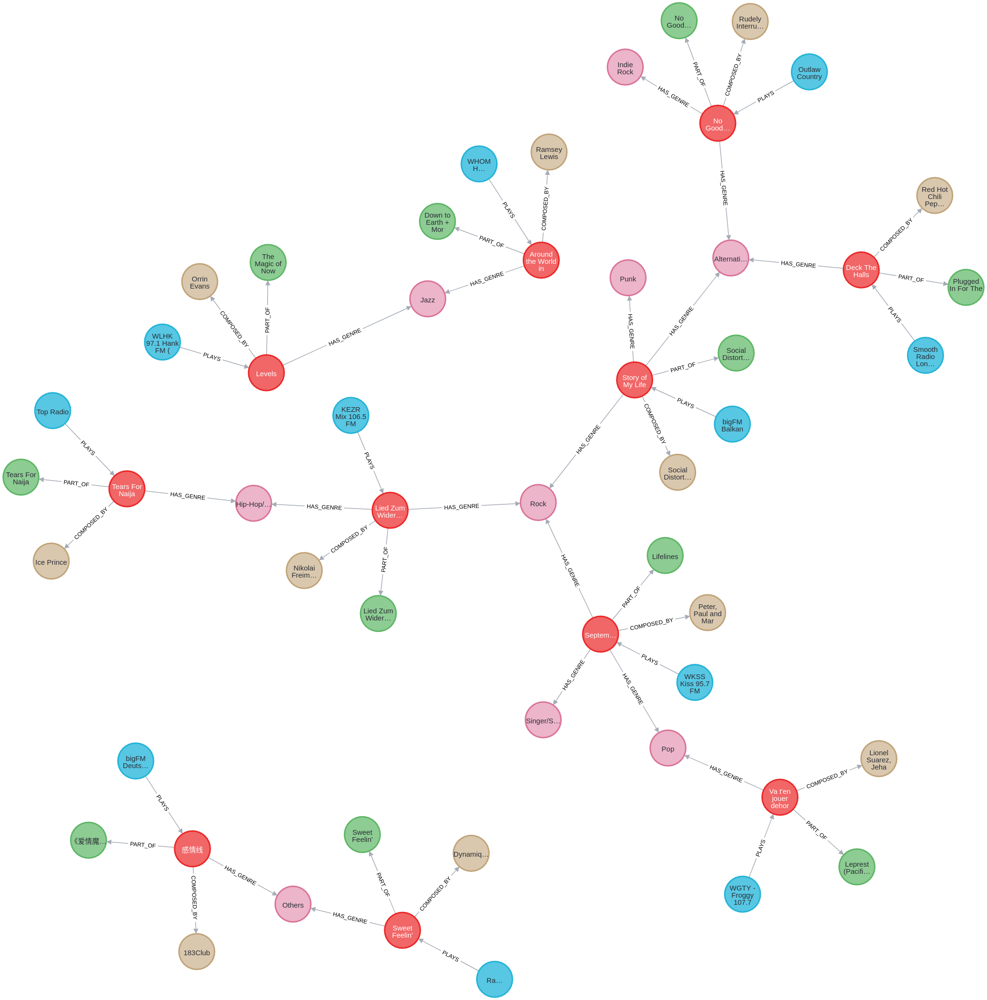

# Neo4j-based Recommendations for Music Streaming (NRMS)

To build a Neo4j based recommendation system MVP. The data is about music radios which is scrapped describing which Radio plays with Track. There are many radios out there and each have their own theme to play music.

Following is the list of documents for the project.

## 1. Project Specifications

### Objective

1) Design a Neo4j schema for a recommendation system.
2) Develop a script to efficiently populate the Neo4j database.
3) Convert complex business requirements into Neo4j queries for recommendation logic.

### Initial Systems Requirements (Phase - I)

We would like to pool track based on artists; so the query will be

- Q1: Tracks from a given artist or multiple artists
- Q2: given a list of track return artists
- Q3: given a list of track return other artists

Following is the initial conceptual schema



### System Requirements (Phase - II)

Part of the challenge is turning the (csv/parquet) file into the format that can be consume by neo4j and making sure it can scale for millions of track

1) Create neo4j database from scratch (docker)
2) Populate the neo4j DB with 80% of rows from csv/parquet file
3) Jupyter notebook with those queries
4) Script to update the neo4j database with remaining 20% of the data

## 2. Creating Docker for Neo4j Graph Database

### Installation

1. First we get the user id (UID) and group id (GID) of the current user through which we are logged in.

```zsh
id -u && id -g
```

the output would be like:

```zsh
502
20
```

Over here `502` the `UID` of current user and `20` is the `GID`.

2. Create a directory e.g., `docker`

```zsh
mkdir docker
```

Now, create following directories inside the directory `docker`

```zsh
mkdir {conf,data,import,logs,plugins}
```

3. Create a `.env` file inside directory `docker` and where have `docker-compose` file. The Contents of the file will be:

Note: make sure to replace your `UID` and `GID`

```zsh
HOST_UID=502
HOST_GID=20
NEO4J_URI=bolt://localhost:7687
NEO4J_USER=neo4j
NEO4J_PASSWORD=your_secret_password
````

4. Create a file `neo4j-docker-compose.yml` inside the directory `docker`. The contents of the are as given below:

```zsh
version: "3"
services:
  neo4j:
    container_name: NRMS
    image: neo4j:5.12.0
    user: "${HOST_UID}:${HOST_GID}"
    volumes:
      - ./data:/data
      - ./plugins:/plugins
      - ./import:/import
    ports:
      - "7474:7474"
      - "7687:7687"
    environment:
      - NEO4J_apoc_export_file_enabled=true
      - NEO4J_apoc_import_file_enabled=true
      - NEO4J_dbms_security_procedures_unrestricted=apoc.*,algo.*
      - NEO4J_server_memory_heap_initial__size=512m
      - NEO4J_server_memory_heap_max__size=2G
      - NEO4J_apoc_uuid_enabled=true
      - NEO4J_server_default__listen__address=0.0.0.0
      - NEO4J_initial_dbms_default__database=neo4j
      - NEO4J_AUTH=neo4j/${NEO4J_PASSWORD}
    networks: 
      - nrms-app-network
    restart: unless-stopped

networks: 
  nrms-app-network: {}

volumes:
  nrms-app-volume: {}

```

Once everything in place , we will execute the following command:

```zsh
docker-compose -f  neo4j-docker-compose.yml  up --build
```

We will see the output similar to following:

````zsh
RecommendationSystem docker-compose -f  docker/neo4j-docker-compose.yml up
[+] Running 2/2
 ✔ Network docker_nrms-app-network  Created                                                                                                                                            0.0s 
 ✔ Container NRMS                   Created                                                                                                                                            0.1s 
Attaching to NRMS
NRMS  | Changed password for user 'neo4j'. IMPORTANT: this change will only take effect if performed before the database is started for the first time.
NRMS  | 2024-02-14 01:58:44.689+0000 INFO  Logging config in use: File '/var/lib/neo4j/conf/user-logs.xml'
NRMS  | 2024-02-14 01:58:44.705+0000 INFO  Starting...
NRMS  | 2024-02-14 01:58:45.277+0000 INFO  This instance is ServerId{59af66b3} (59af66b3-1497-4d74-b2da-30abad5e7b72)
NRMS  | 2024-02-14 01:58:45.788+0000 INFO  ======== Neo4j 5.12.0 ========
NRMS  | 2024-02-14 01:58:48.847+0000 INFO  Bolt enabled on 0.0.0.0:7687.
NRMS  | 2024-02-14 01:58:49.359+0000 INFO  HTTP enabled on 0.0.0.0:7474.
NRMS  | 2024-02-14 01:58:49.360+0000 INFO  Remote interface available at http://localhost:7474/
NRMS  | 2024-02-14 01:58:49.362+0000 INFO  id: D1774357C39D1FA82B8EE4AE966D1EA9F3634D34C72D9C0EBC66CD01832E0EDA
NRMS  | 2024-02-14 01:58:49.362+0000 INFO  name: system
NRMS  | 2024-02-14 01:58:49.362+0000 INFO  creationDate: 2024-02-14T01:58:46.313Z
NRMS  | 2024-02-14 01:58:49.363+0000 INFO  Started.

````

Enter the URL <http://localhost:7474/> to access Neo4j. You will see following screen




## 3. Database Schema
- Following is the Schema of NRMS after loading the data



#### Following is a representation of nodes and relationship interconnectivity




## 4. Environment Setup

Following are the steps to build this graph database environment

- Change the directory to `python_code` install install requirements.txt

```zsh
pip install -r requirements.txt
```

And then


```zsh
python load_data.py
```

Make sure to create `.env` file in `docker` directory with following contents

```
HOST_UID=502
HOST_GID=20
NEO4J_URI=bolt://localhost:7687
NEO4J_USER=neo4j
NEO4J_PASSWORD=your_secret_password
```

If you are running docker-compose file from project root then command will be:

```
docker-compose -f  docker/neo4j-docker-compose.yml  up
```

If you are running docker-compose file from within docker directoy then command will be:

```
docker-compose -f neo4j-docker-compose.yml  up 
```

When the enviroment is already created, then you may run following commands as per requirements

`up` to create and start containers

`start` to start services

`stop` to stop services

```zsh
docker-compose -f  docker/neo4j-docker-compose.yml  COMMAND
```

### Finally Jupyter notebook file to execute your queries

Jupyter notebook is palced in direcory `jupyter_cypher`

#### Sample Cypher queries if you want to test directly on Neo4j interface OR in Jupyter notebook


```SQL

// Working data load
CALL apoc.periodic.iterate(
  "LOAD CSV WITH HEADERS FROM 'file:///music_radio.csv' AS row RETURN row",
  "
    MERGE (radio:Radio {id: row.RADIO_ID})
      ON CREATE SET radio.name = row.RADIO_NAME, radio.genre = row.RADIO_GENRE,
                    radio.market = COALESCE(row.RADIO_MARKET, 'Unknown'), radio.city = row.RADIO_CITY, radio.countryCode = row.RADIO_CC

    MERGE (track:Track {isrc: row.ISRC})
      ON CREATE SET track.name = row.TRACK_NAME, track.albumName = row.ALBUM_NAME,
                    track.spotifyPlaylistCount = toInteger(row.SPOTIFY_PLAYLIST_COUNT),
                    track.genres = apoc.convert.fromJsonList(row.GENRES)

    WITH row, track
    UNWIND apoc.convert.fromJsonList(row.SPOTIFY_ARTIST_IDS) AS spotifyArtistId
    MERGE (artist:Artist {spotifyId: spotifyArtistId})
      ON CREATE SET artist.name = row.ARTIST_NAME, artist.code = row.ARTIST_CODE, artist.cmArtist = row.CM_ARTIST,
                    artist.genre = apoc.convert.fromJsonList(row.ARTIST_GENRE)
    MERGE (track)-[:COMPOSED_BY]->(artist)

    WITH row, track, artist  // Carry over 'row' along with 'track' and 'artist'
    WHERE NOT row.ALBUM_NAME IS NULL AND row.ALBUM_NAME <> ''
    MERGE (album:Album {name: row.ALBUM_NAME})
    MERGE (track)-[:PART_OF]->(album)

    WITH row, artist  // Carry over 'row' and 'artist' for the next steps
    UNWIND apoc.convert.fromJsonList(row.SPOTIFY_RELATED_ARTISTS_IDS) AS relatedSpotifyId
    MERGE (relatedArtist:Artist {spotifyId: relatedSpotifyId})
    MERGE (artist)-[:RELATED_TO]->(relatedArtist)

    WITH row  // Ensure 'row' is available for genre processing
    UNWIND apoc.convert.fromJsonList(row.GENRES) AS genreName
    MERGE (genre:Genre {name: genreName})
    MERGE (track)-[:HAS_GENRE]->(genre)  // 'track' needs to be reintroduced if it's not in the current scope

  ",
  {batchSize:1000, parallel:false}
)
```

## 2. Recommendation Cypher Queries

### Given a Track, find related Artists - 1st Level Traversal

```SQL

MATCH (track:Track {name: "Night Time Is the Right Time"})-[:COMPOSED_BY]->(artist:Artist)
WITH artist, track
MATCH (artist)-[:RELATED_TO]->(related:Artist)<-[:COMPOSED_BY]-(relatedTrack:Track)
RETURN track.name, artist.spotifyId AS ArtistSpotifyID, collect(related.spotifyId) AS SimilarArtistSpotifyIDs, collect(relatedTrack.name) AS SimilarTracks
```

### Given a Track, find related Artists - 2nd Level Traversal (Skip immediate `RELATED_TO` and start finding similarityat second hop )

```SQL
MATCH (track:Track {name: "Night Time Is the Right Time"})-[:COMPOSED_BY]->(artist:Artist)
WITH artist, track
MATCH (artist)-[:RELATED_TO*2..2]->(related:Artist)<-[:COMPOSED_BY]-(relatedTrack:Track)
RETURN track.name, artist.spotifyId AS ArtistSpotifyID, collect(related.spotifyId) AS SimilarArtistSpotifyIDs, collect(relatedTrack.name) AS SimilarTracks
```

### // Given a Track, find related Artists - Include 1st level and 2nd Level

```SQL

MATCH (track:Track {name: "Night Time Is the Right Time"})-[:COMPOSED_BY]->(artist:Artist)
WITH artist, track
MATCH (artist)-[:RELATED_TO*1..2]->(related:Artist)<-[:COMPOSED_BY]-(relatedTrack:Track)
RETURN track.name, artist.spotifyId AS ArtistSpotifyID, collect(related.spotifyId) AS SimilarArtistSpotifyIDs, collect(relatedTrack.name) AS SimilarTracks
````
